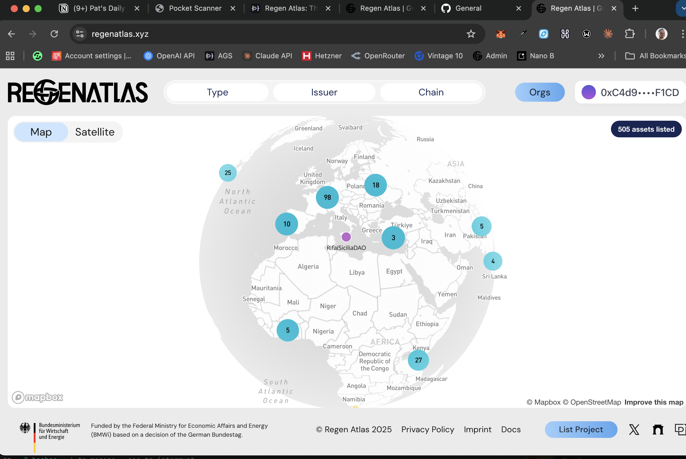
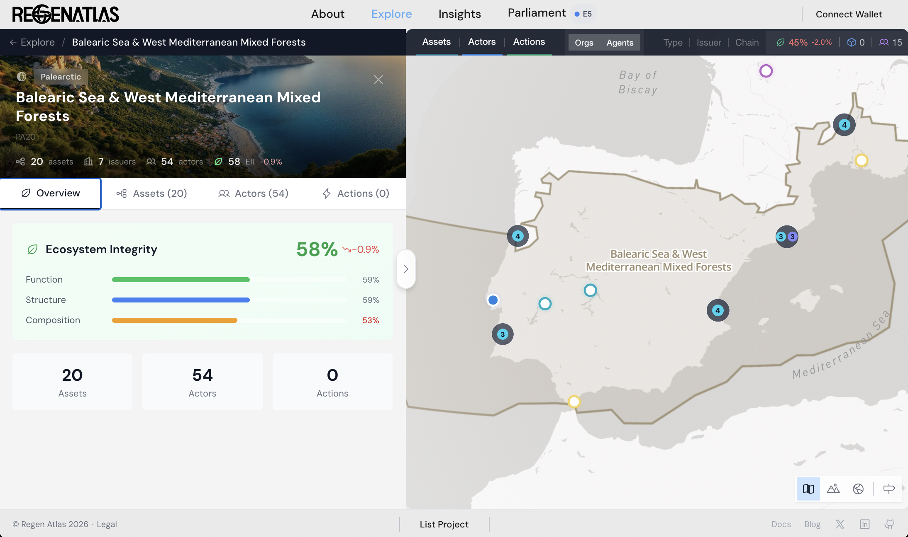
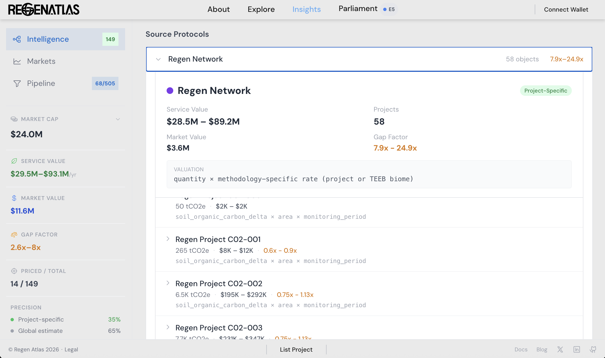
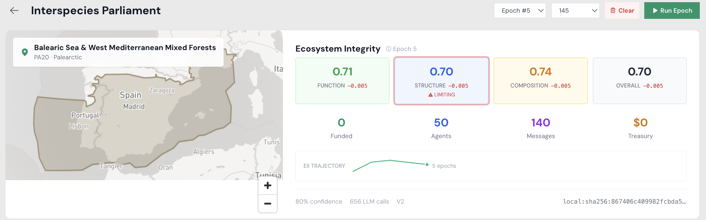

# Regen Atlas

**The largest curated registry of tokenized green assets in crypto — extended with verifiable provenance, scientific valuation, and AI-native governance.**

Built for [PL_Genesis: Frontiers of Collaboration](https://pl-genesis.devfolio.co/) | Existing Code Track | [Live prototype](https://regen-atlas-ecospatial.vercel.app/) | [Original codebase](https://regenatlas.xyz)

---

## What Existed Before the Hackathon



Regen Atlas is an open-source, map-based platform for discovering tokenized environmental assets. Before PL_Genesis, it was a **static registry**:

- 505 assets across 8 types, 30 subtypes, 14 issuers, 17 chains
- Map-based explorer with Type / Issuer / Chain / Orgs filters
- Asset detail pages with token metadata
- Supabase backend, Mapbox map, WalletConnect

**No provenance verification. No impact measurement. No valuation. No governance.**

---

## What We Built (PL_Genesis Hackathon)







### Filecoin Provenance Layer

Every green asset gets a structured provenance object stored on Filecoin via the Synapse SDK (Calibration Testnet). Origin project, methodology, MRV status, vintage — content-addressed and independently verifiable.

- "Verified on Filecoin" badge on asset cards with clickable CID links
- Impact Provenance detail view: source protocol, methodology, metrics, valuation range, gap factor
- Gateway verification at `calibration.filbeam.io`
- Local SHA-256 CID fallback when Filecoin upload is unavailable
- **Bundle CID:** `bafkzcibe7onr2eecyla3n3dxe62o3uu5osjf7kldf5xm5szruc4nrazsxw6zjlrfcy`

### Impact Intelligence Pipeline

Cross-protocol ingestion composing verifiable provenance objects from three live data sources:

- **Toucan Protocol** — Polygon subgraph: TCO2 tokens, pool balances, retirements (tCO2e)
- **Regen Network** — Cosmos LCD: credit classes, project metadata, batch supply, sell orders
- **Glow** — Weekly JSON archives: aggregate network MWh, per-farm audit data

Each provenance object carries source chain reproducibility metadata, impact metrics, and MRV status.

### Ecosystem Service Valuation Engine

Scientific valuation using EPA Social Cost of Carbon (SCC-EPA-2024) and TEEB biome rates:

- 19 valuation methodologies across 4 impact dimensions (climate, biodiversity, energy, marine)
- Per-unit valuation (USD/tCO2e, USD/ha/yr) with low-high confidence ranges
- **Ecological Impact Gap** — ratio of ecosystem service value to token market price
- NPV scaling (3% discount, 30yr horizon)
- Live price feeds from CoinGecko and DexScreener
- 10+ embedded academic citations (EPA SCC, Costanza 2014, de Groot 2012, Barbier 2011, TEEB)

### Interspecies Parliament

AI-native governance layer where 8 agents representing species, biomes, climate systems, and economic models deliberate over bioregional proposals:

- 7-phase epochs: deliberation, staking, settlement, memory
- EII (Ecosystem Integrity Index) carries forward between epochs with natural decay and noise
- Recursive agent memory — agents reference rivals' past strategies
- Every epoch content-addressed with provenance chain linking
- Agents post bounties for human ground-truth verification
- Parliament simulation server with threaded feed UI

### UI Overhaul

The entire interface was redesigned from a simple filter-and-map registry into a multi-layer exploration platform:

- **New navigation architecture** — About, Explore, Insights, Parliament tabs replacing the flat filter bar
- **Bioregion explorer** — One Earth bioregion boundaries with EII scores, asset/actor/action counts, and drill-down panels
- **Ecosystem Integrity dashboard** — Function, Structure, Composition pillars with trend indicators and limiting factor highlighting
- **Intelligence dashboard** — Per-source ingest progress, aggregate metrics (tCO2e, credits, MWh), and upload controls
- **About page** — Project mission, architecture overview, team info
- **Redesigned asset cards** — Provenance badges, valuation ranges, gap factors integrated into existing card layout

---

## Architecture

```
src/
├── modules/
│   ├── intelligence/          # Impact Intelligence Pipeline (NEW)
│   │   ├── compose.ts              # Cross-protocol provenance composition
│   │   ├── sources/toucan.ts       # Toucan Protocol ingestion
│   │   ├── sources/regen.ts        # Regen Network ingestion
│   │   └── sources/glow.ts         # Glow ingestion
│   ├── filecoin/              # Filecoin Provenance Layer (NEW)
│   │   ├── ProvenanceService.ts    # Matching, caching, upload (633 lines)
│   │   ├── useSynapse.ts           # Synapse SDK lifecycle hook
│   │   └── useProvenance.ts        # Cache hydration, CID restore
│   ├── ecospatial/            # Ecospatial Extensions (NEW)
│   │   ├── parliament/             # Interspecies Parliament engine
│   │   ├── eii/                    # Ecosystem Integrity Index
│   │   ├── proposals/              # Bioregional proposal system
│   │   └── vaults/                 # Vault mechanics (experimental)
│   └── [existing modules]    # Uniswap, viem, analytics, filters, etc.
├── Ecospatial/                # Parliament UI (NEW)
├── Intelligence/              # Pipeline dashboard (NEW)
├── Explore/                   # Map explorer (extended with provenance badges)
├── AssetDetails/              # Asset pages (extended with provenance section)
└── shared/                    # Components, hooks, helpers

simulation/                    # Parliament simulation server
├── server.js                       # Express server, 7-phase epoch runner
├── epoch.js                        # Epoch lifecycle + agent orchestration
├── agents.js                       # Agent definitions + LLM integration
├── memory.js                       # Recursive agent memory
└── llm.js                          # OpenRouter client

contracts/                     # Solidity (Foundry) — config and deployment scripts
backend/                       # Express API server
subgraph/                      # The Graph subgraph schema
```

## Tech Stack

React 19, TypeScript, Vite, Tailwind CSS, Mapbox GL, Recharts, Supabase, WalletConnect, Foundry/Forge, Solidity, The Graph

**Hackathon additions:** Filecoin Synapse SDK, OpenRouter, CoinGecko API, DexScreener API, Toucan Subgraph (The Graph), Regen Network LCD (Cosmos), Glow API

## Getting Started

```bash
git clone https://github.com/papa-raw/ecospatial.git
cd ecospatial
cp .env.example .env       # Fill in API keys
npm install
npm run dev                # http://localhost:5173
```

See `.env.example` for required environment variables.

## Changelog (Built During PL_Genesis)

Everything below was built from scratch during the hackathon window (Feb 10 – Mar 16, 2026). The pre-existing codebase was a static registry with no provenance, valuation, or governance features.

| Feature | New LOC | Bounty Satisfied |
|---|---|---|
| **Filecoin Provenance Layer** — Synapse SDK integration, structured provenance objects, CID upload/restore, "Verified on Filecoin" badges, gateway verification | ~800 | Filecoin |
| **Impact Intelligence Pipeline** — Cross-protocol ingestion (Toucan, Regen Network, Glow), provenance composition, source chain metadata | ~1,200 | Crypto |
| **Ecosystem Service Valuation Engine** — 19 methodologies, EPA SCC + TEEB rates, Ecological Impact Gap, live price feeds, academic citations | ~900 | Funding the Commons |
| **Interspecies Parliament** — 8 AI agents, 7-phase epochs, EII scoring, recursive memory, simulation server | ~1,000 | Crypto |
| **UI Overhaul** — New navigation (About/Explore/Insights/Parliament), bioregion explorer, EII dashboard, intelligence dashboard, provenance cards | ~600 | Existing Code |
| **Total** | **~4,500** | |

### How Each Bounty Is Satisfied

- **Filecoin** — Every green asset gets a content-addressed provenance object stored via the Synapse SDK on Calibration Testnet. Bundle CID: `bafkzcibe7onr2eecyla3n3dxe62o3uu5osjf7kldf5xm5szruc4nrazsxw6zjlrfcy`. Verifiable at `calibration.filbeam.io`.
- **Crypto** — Onchain provenance for tokenized environmental assets across 3 protocols and 17 chains. Scientific valuation makes ecological value legible to crypto markets.
- **Funding the Commons** — The Ecological Impact Gap metric exposes systematic capital underallocation to ecosystem services. Most tokenized green assets trade at <10% of their ecological service value.

## Challenges

- **Existing Code** — Built on the existing Regen Atlas codebase
- **Filecoin** — Synapse SDK for immutable provenance storage (Calibration Testnet)
- **Crypto** — Onchain provenance, scientific valuation of tokenized assets
- **Funding the Commons** — Ecological Impact Gap exposes capital underallocation to ecosystem services

## Team

**Ecofrontiers** — [Patrick Rawson](https://github.com/papa-raw) | [X](https://x.com/papa_raw) | [LinkedIn](https://www.linkedin.com/in/pat-rawson-48306867)

## License

MIT
